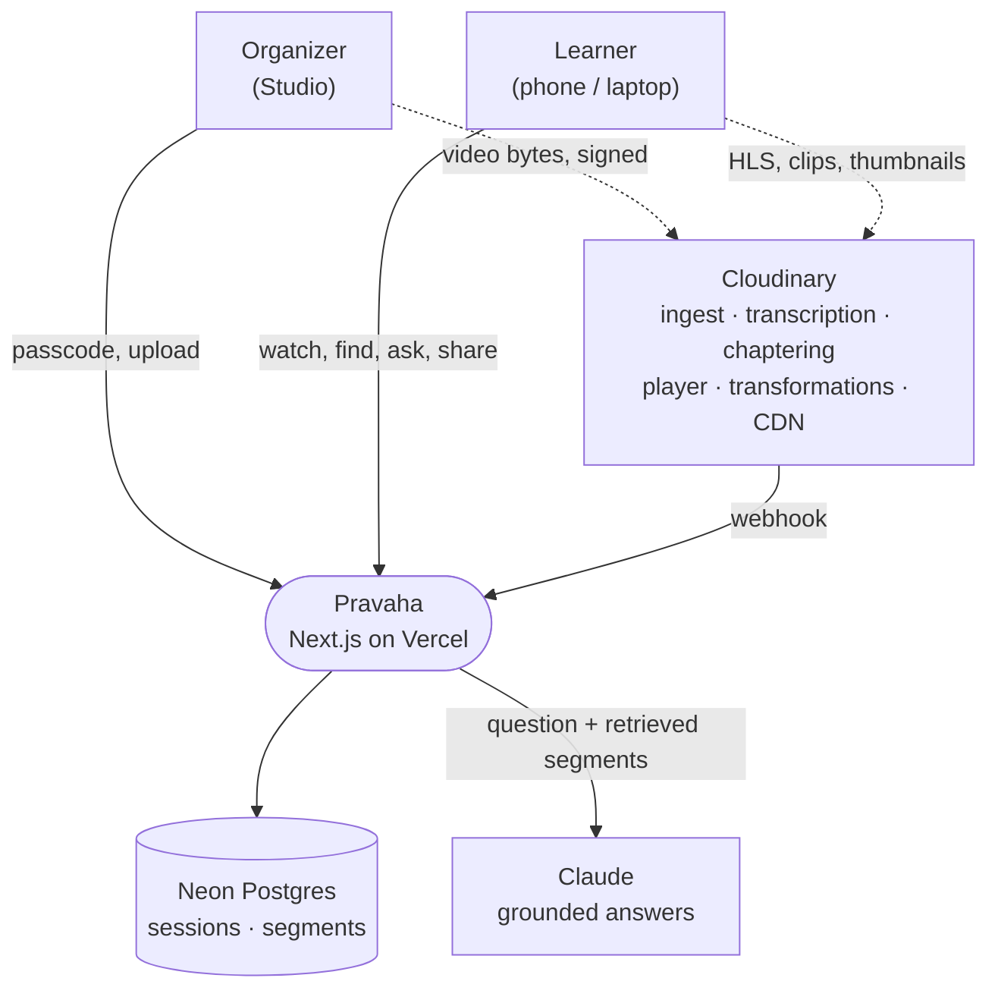
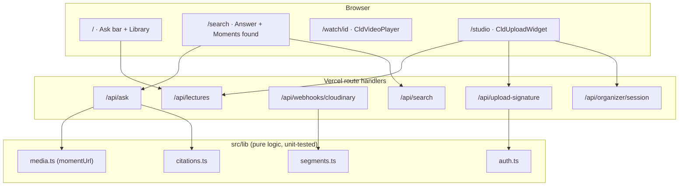
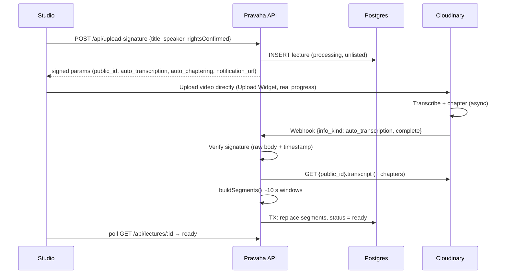
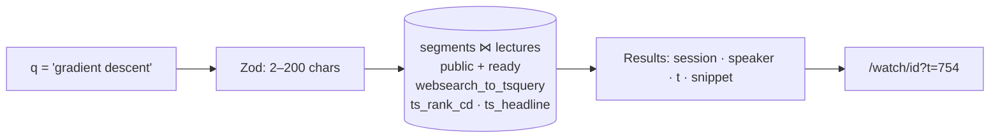
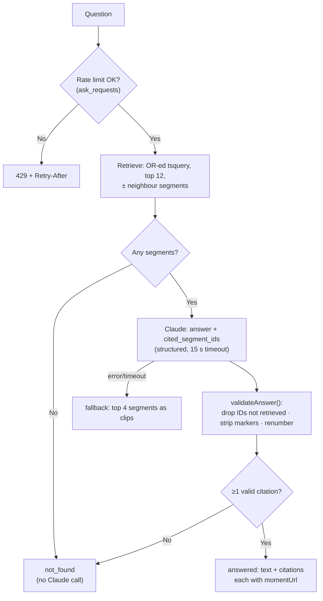
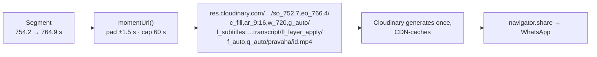
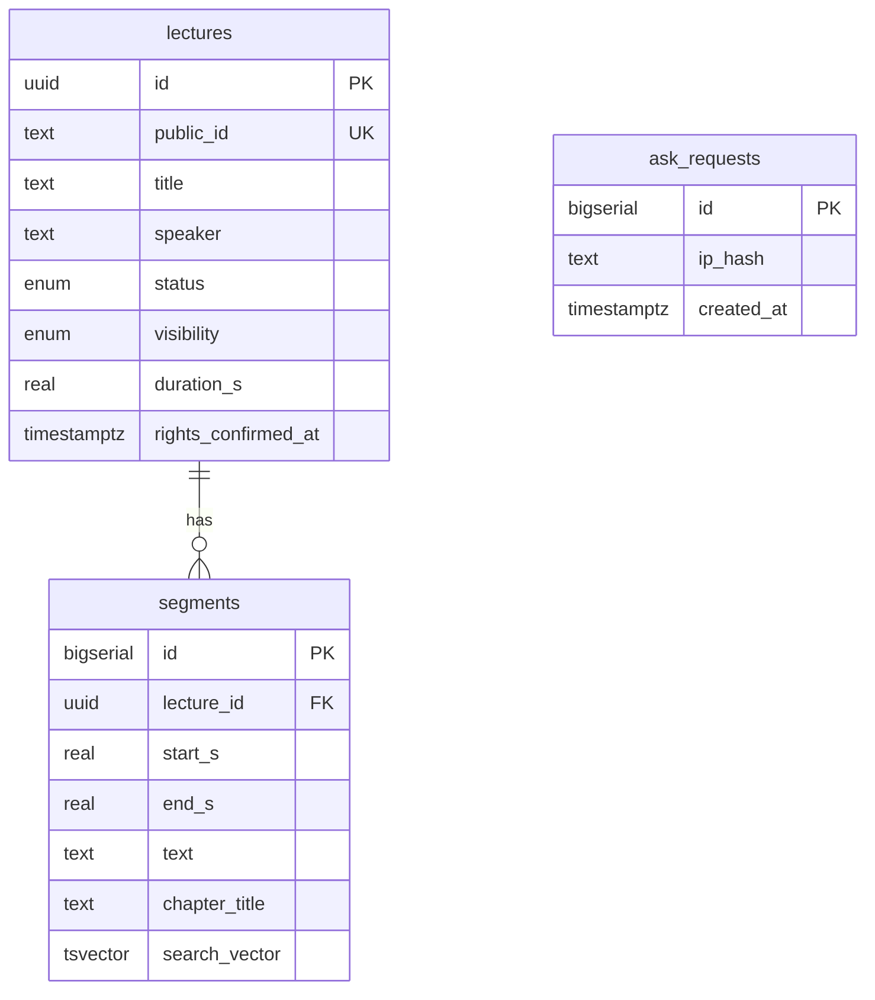
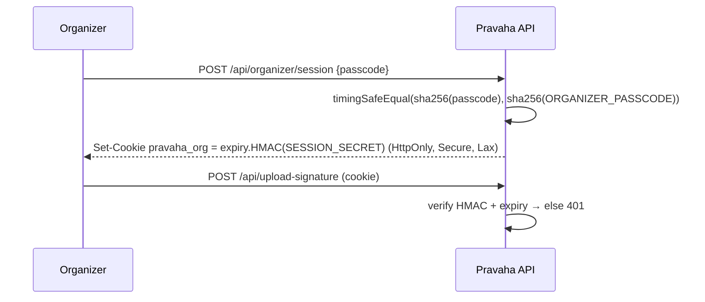
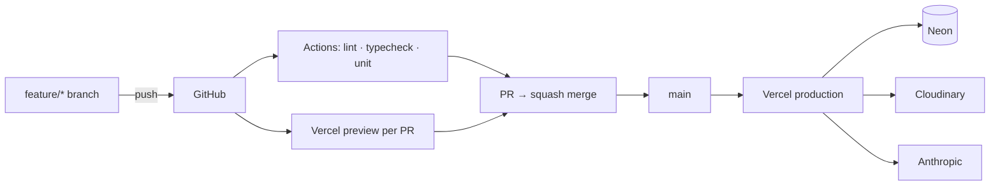

# System Architecture — Pravaha

Read `PRD.md`, `CLOUDINARY.md` and `TRD.md` first; these diagrams show those decisions in motion.

## 1. System Context

Media never passes through Pravaha. Cloudinary is the media plane; Pravaha is the knowledge plane.

## 2. Components

## 3. Ingest — Upload to Ready

Failure branch: `info_status: failed` → `transcript_failed`; the video still plays (NFR4).

## 4. Find

No AI, no Cloudinary API call — milliseconds.

## 5. Ask — the core flow

The model can only cite what retrieval returned, and anything else is deleted before the learner sees it.

## 6. Moments

## 7. Data

## 8. Organizer Auth

## 9. Deployment

Branching rules: `GIT_WORKFLOW.md`.
